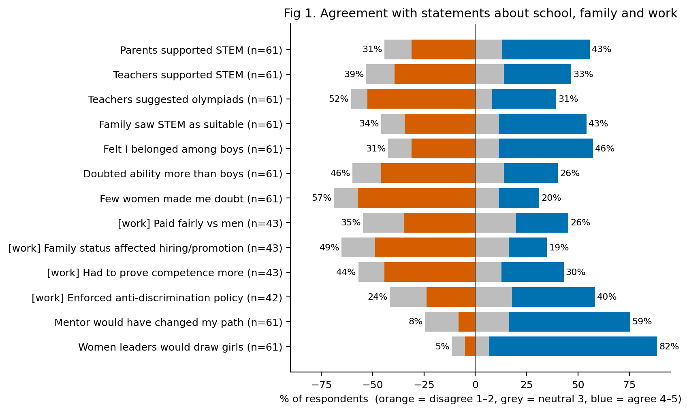
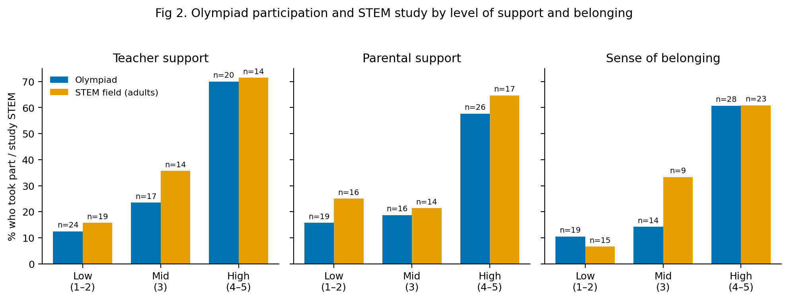
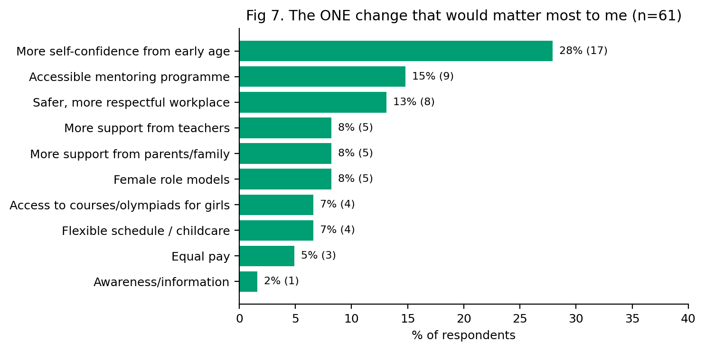

# Women in STEM/IT in Kyrgyzstan – analysis code

Code, aggregate results and figures for the paper *Factors Associated with Girls' and Women's Participation in STEM and IT in Kyrgyzstan: A Survey of 61 Respondents* (D. Zhamalidinova, 2026).

Analysis of an online survey (n = 61, Google Forms) on the paths of girls and women into STEM/IT in Kyrgyzstan:
what in school and family is associated with entering STEM, what women meet at work, and which measures respondents see as most helpful.

## Research questions
| RQ | Question | Tables | Figures |
|---|---|---|---|
| RQ1 | Which school/family factors (parental & teacher support, role models, mentors, belonging, place of childhood) are associated with a STEM class, olympiad participation and a STEM field of study? | sheets 3–10 | Fig 1–4 |
| RQ2 | What do women experience at work (interview questions about family, maternity leave, pay, behaviour of male colleagues)? | sheets 11–13 | Fig 5 |
| RQ3 | Which measures do respondents consider most effective? | sheets 14–15 | Fig 6–7 |

## Contents
| Path | What it is |
|---|---|
| `analysis.py` | The whole analysis: cleaning → codebook → tests → tables → figures |
| `data/codebook.csv` | Every variable: original question (Russian), type, coding |
| `results/results_tables.xlsx` | 16 result sheets + a README sheet explaining every test |
| `results/run_log.txt` | Row counts, parsing notes, software versions |
| `figures/fig1…fig7.png` | Figures 1–7 |

## Key figures




All figures are in [`figures/`](figures).

## How to reproduce
Requires Python 3.10+ (the published results were produced with Python 3.12, pandas 3.0, scipy 1.17 – see `results/run_log.txt`).

```bash
python -m venv .venv
source .venv/bin/activate        # Windows: .venv\Scripts\activate
pip install -r requirements.txt
python analysis.py path/to/raw_google_forms_export.xlsx .
```
The raw export is not public (see *Data availability*). The second argument is the output folder; `data/`, `results/` and `figures/` are (re)created inside it. Manual STEM codes entered in `data/specialty_coding.csv` (`manual_code`) are kept between runs.

## Data availability
The repository contains no respondent-level data: only the code, the codebook, aggregate results tables and figures.
Participants were assured that their answers would remain confidential, and some of them are under 18, so the anonymised dataset is not published.
It is available from the author on reasonable request for research purposes. <!-- TODO: contact -->

The raw survey export and the cleaned respondent-level files that `analysis.py` writes to `data/` are excluded via `.gitignore`.

## Notes on the analysis
- **Likert items** use a five-point scale (1 = strongly disagree … 5 = strongly agree) and are treated as ordinal.
- **STEM field of study** is coded from free-text answers using a keyword list (`KW` in `analysis.py`); ambiguous answers are flagged for manual review. Only adult respondents with a stated field are included.
- **"Not applicable"** answers are treated as missing; every percentage reports its denominator.
- **Top-3 measures:** 15 respondents selected more than three options; their answers are kept as given.
- **Open-ended answers** are analysed separately (reflexive thematic analysis, Braun & Clarke 2006) and are not part of this code.

## Methods
- Medians and % agree / disagree for Likert items; Mann–Whitney U with rank-biserial r; Spearman correlations (Sullivan & Artino, 2013).
- Fisher's exact test for binary factors, with Haldane-corrected odds ratios.
- Holm correction across the 39 tests in sheet 5 (Holm, 1979); sheet 6 repeats them for adults only as a robustness check.
- Cronbach's alpha for candidate scales (Tavakol & Dennick, 2011).

## Limitations
Non-random, self-selected sample (n = 61); small subgroups (15 IT/STEM workers, 10 with a female role model, 18 with a mentor); retrospective self-report; the same items were answered by schoolgirls and adults. Results are associations, not causal effects, and some may run in reverse. Views on which interventions work (RQ3) reflect respondents' opinions, not evidence of effect.

## License
- Code (`analysis.py`): [MIT](LICENSE)
- Figures, results tables, codebook and documentation: [CC BY 4.0](LICENSE-CC-BY-4.0.md)

## Citation
Zhamalidinova, D. (2026). *Factors Associated with Girls' and Women's Participation in STEM and IT in Kyrgyzstan: A Survey of 61 Respondents.* Independent research. <!-- TODO: link to the paper -->
